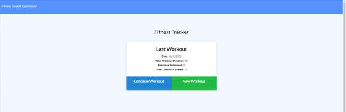

# ecstatic-exertion

A app to track your workouts and compile weekly stats.

## Installation

This application requires the Mongoose, Express, and Morgan modules.  The data is stored using a MongoDB database, with a single Workout model.  The routes are managed using an HTML routes js file and an api routes js file. The pages themselves are static html files in the public folder, along with accompanying js files that control events on the page and make the initial ajax calls.

The express server is controlled and started using the server.js file.

## Usage 

The application is deployed to: https://arcane-everglades-22816.herokuapp.com/ 

The user only sees the main page that has allows the user to either create a new workout or continue the most previous workout.  Both options take the user to an exercise page, where they create an exercise from form fields and then add to the workout - which is either a new workout or an existing workout.  On hitting "complete" the user is brought back to the main page with stats being shown to reflect the workout just used, which now has exercises attached to it.

There is also a "dashboard" page that shows charts/stats based on the workouts from the previous week.  This is accessible from the navbar.

-----

Below is screenshot of the main page section.

## Credits

Created by: Christopher Cruzcosa

## License

Copyright (c) [2020] [Christopher Cruzcosa]

Permission is hereby granted, free of charge, to any person obtaining a copy
of this software and associated documentation files (the "Software"), to deal
in the Software without restriction, including without limitation the rights
to use, copy, modify, merge, publish, distribute, sublicense, and/or sell
copies of the Software, and to permit persons to whom the Software is
furnished to do so, subject to the following conditions:

The above copyright notice and this permission notice shall be included in all
copies or substantial portions of the Software.

THE SOFTWARE IS PROVIDED "AS IS", WITHOUT WARRANTY OF ANY KIND, EXPRESS OR
IMPLIED, INCLUDING BUT NOT LIMITED TO THE WARRANTIES OF MERCHANTABILITY,
FITNESS FOR A PARTICULAR PURPOSE AND NONINFRINGEMENT. IN NO EVENT SHALL THE
AUTHORS OR COPYRIGHT HOLDERS BE LIABLE FOR ANY CLAIM, DAMAGES OR OTHER
LIABILITY, WHETHER IN AN ACTION OF CONTRACT, TORT OR OTHERWISE, ARISING FROM,
OUT OF OR IN CONNECTION WITH THE SOFTWARE OR THE USE OR OTHER DEALINGS IN THE
SOFTWARE.